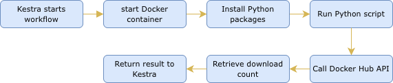
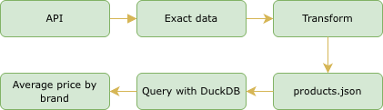

# Kestra Data Engineering Workflows

This repository contains example workflows built with **Kestra** as part of learning data engineering pipelines.

The workflows demonstrate:

- Basic workflow execution
- Running Python scripts in Docker
- Building a simple ETL pipeline

---

# 1. Hello World Workflow

This workflow demonstrates the basic structure of a Kestra pipeline.

## Features

- Print input and output messages
- Use variables
- Demonstrate task execution order
- Pause the workflow for **15 seconds**

## Workflow Steps

This workflow helps understand the fundamental concepts of Kestra such as:

- Inputs
- Variables
- Tasks
- Outputs
- Scheduling

---

# 2. Python Workflow

This workflow demonstrates how Kestra can execute Python scripts inside a Docker container.

## Pipeline Overview

The workflow performs the following steps:

1. Run Python inside a Docker container
2. Install required Python packages
3. Call the Docker Hub API
4. Retrieve the number of downloads for the **Kestra Docker image**
5. Store the result as a workflow output
6. Track execution metrics

## Execution Flow

This example shows how Kestra can orchestrate containerized scripts using Docker.

---

# 3. ETL Data Pipeline

This workflow demonstrates a simple **ETL (Extract, Transform, Load) pipeline** using Kestra.

## Pipeline Steps

### Extract

Download product data from an external API.

### Transform

Use Python to filter and process the JSON data.

### Query

Use **DuckDB** to run SQL queries on the transformed data.

## Pipeline Architecture

This pipeline demonstrates how Kestra can orchestrate:

- API data ingestion
- Python-based transformations
- SQL analytics with DuckDB

---

# Technologies Used

- Kestra
- Docker
- Python
- DuckDB
- REST APIs

---

# Purpose of This Repository

This project was created to learn and practice:

- Workflow orchestration
- Containerized task execution
- Data pipeline development
- ETL pipeline design

## 4. PostgreSQL Taxi Data Pipeline

This workflow loads **NYC Taxi trip data** into a PostgreSQL database using **Kestra**.

The data used in this workflow comes from:

https://github.com/DataTalksClub/nyc-tlc-data/releases

---

## Workflow Overview

This pipeline performs the following steps:

---

## Input Parameters

The workflow allows users to select the dataset using three inputs.

| Input | Description       | Options           | Default  |
| ----- | ----------------- | ----------------- | -------- |
| taxi  | Taxi dataset type | `yellow`, `green` | `yellow` |
| year  | Dataset year      | `2019`, `2020`    | `2019`   |
| month | Dataset month     | `01` – `12`       | `01`     |
