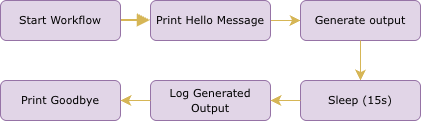
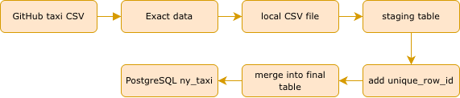

# Kestra Data Engineering Workflows

This repository contains example workflows built with **Kestra** as part of learning modern **data engineering pipelines**.

The workflows demonstrate:

- Workflow orchestration with Kestra
- Containerized task execution with Docker
- Building ETL and ELT pipelines
- Working with PostgreSQL and cloud data platforms
- Implementing AI workflows with and without RAG

---

# Repository Overview

This project covers the following workflow categories:

| Category             | Description                          |
| -------------------- | ------------------------------------ |
| Basic Workflows      | Introductory Kestra pipelines        |
| Python Execution     | Running Python scripts inside Docker |
| Local Data Pipelines | ETL pipelines using PostgreSQL       |
| Cloud Data Pipelines | GCP Data Lake + BigQuery pipelines   |
| AI Workflows         | LLM interaction and RAG pipelines    |

---

# 1. Hello World Workflow

This workflow demonstrates the **basic structure of a Kestra pipeline**.

## Features

- Use workflow **inputs**
- Define **variables**
- Execute multiple **tasks**
- Return **outputs**
- Pause workflow execution for **15 seconds**

## Workflow Steps

This workflow introduces key Kestra concepts:

- Inputs
- Variables
- Tasks
- Outputs
- Scheduling

---

# 2. Python Workflow (Docker Execution)

This workflow demonstrates how **Kestra can execute Python scripts inside a Docker container**.

## Pipeline Overview

The workflow performs the following steps:

1. Run Python inside a Docker container
2. Install required Python packages
3. Call the Docker Hub API
4. Retrieve the number of downloads for the **Kestra Docker image**
5. Store the result as a workflow output
6. Track execution metrics

## Execution Flow

This example shows how Kestra orchestrates **containerized scripts using Docker**.

---

# 3. ETL Data Pipeline

This workflow demonstrates a simple **ETL (Extract, Transform, Load) pipeline**.

## Pipeline Steps

### Extract

Download product data from an external API.

### Transform

Use Python to process and filter JSON data.

### Query

Use **DuckDB** to run SQL queries on the transformed data.

## Pipeline Architecture

This workflow demonstrates:

- API data ingestion
- Python-based data transformation
- SQL analytics using DuckDB

---

# 4. PostgreSQL Taxi Data Pipeline

This workflow loads **NYC Taxi trip data** into a PostgreSQL database using Kestra.

Dataset source:

https://github.com/DataTalksClub/nyc-tlc-data/releases

## Pipeline Architecture

## Pipeline Steps

1. Download NYC Taxi dataset
2. Load raw data into a **staging table**
3. Generate unique identifiers for records
4. Merge data into the final analytics table

## Input Parameters

| Input | Description       | Options       | Default |
| ----- | ----------------- | ------------- | ------- |
| taxi  | Taxi dataset type | yellow, green | yellow  |
| year  | Dataset year      | 2019, 2020    | 2019    |
| month | Dataset month     | 01 – 12       | 01      |

---

# 5. Scheduled PostgreSQL Taxi Pipeline

This workflow automates the previous taxi ETL pipeline using **scheduled triggers**.

## Key Differences from Manual Pipeline

| Feature     | Manual Pipeline   | Scheduled Pipeline      |
| ----------- | ----------------- | ----------------------- |
| Inputs      | taxi, year, month | taxi only               |
| File naming | Based on inputs   | Based on `trigger.date` |
| Execution   | Manual            | Automatic               |
| Scheduling  | None              | Monthly cron            |
| Concurrency | None              | Limit 1 execution       |

The pipeline runs automatically on the **first day of each month**.

---

# 6. GCP Infrastructure Setup

This workflow prepares the **Google Cloud environment** required for the cloud pipelines.

It creates:

- Google Cloud Storage **bucket (data lake)**
- BigQuery **dataset (data warehouse)**

## Cloud Architecture

The workflow retrieves configuration values from the **Kestra KV store**:

- `GCP_PROJECT_ID`
- `GCP_BUCKET_NAME`
- `GCP_DATASET`
- `GCP_LOCATION`

---

# 7. GCP Taxi Data Pipeline (Cloud ELT)

This workflow implements a **cloud-based ELT pipeline** using:

- Google Cloud Storage
- BigQuery
- Kestra orchestration

## Pipeline Architecture

## Pipeline Steps

1. Download taxi dataset
2. Upload raw CSV to **GCS bucket**
3. Create **BigQuery external table**
4. Transform data using SQL
5. Merge records into final warehouse table

This pipeline demonstrates a modern **ELT architecture** where transformations happen inside the **data warehouse**.

---

# 8. AI Workflow — Chat Without RAG

This workflow demonstrates the limitations of querying an LLM **without external context**.

The model relies only on its **training data**, which may lead to:

- outdated information
- hallucinated features
- vague responses

## Workflow Architecture

This workflow highlights why **context retrieval is important** when working with LLMs.

---

# 9. AI Workflow — Chat With RAG

This workflow demonstrates **Retrieval Augmented Generation (RAG)**.

It improves LLM responses by retrieving relevant documentation before generating an answer.

## Pipeline Architecture

## Pipeline Steps

1. Ingest Kestra release documentation
2. Generate **embeddings**
3. Store embeddings in Kestra vector storage
4. Retrieve relevant document sections
5. Generate a grounded LLM response

This results in **more accurate and context-aware answers**.

---

# Technologies Used

- Kestra
- Docker
- Python
- DuckDB
- PostgreSQL
- Google Cloud Storage
- BigQuery
- Google Gemini API
- RAG (Retrieval-Augmented Generation)

---

# Learning Goals

This project was created to practice:

- Workflow orchestration
- Containerized task execution
- ETL / ELT pipeline design
- Cloud data engineering
- Data lake and data warehouse architectures
- LLM integration in data workflows
- Retrieval-Augmented Generation (RAG)

---
